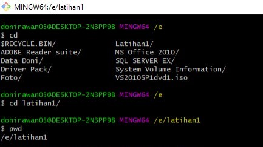
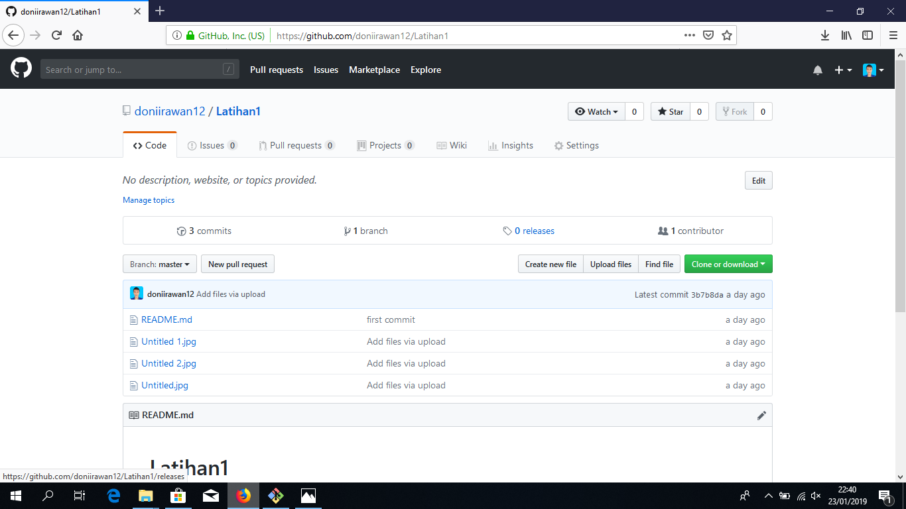

# Perintah Dasar Git <h2>
* _**git init**_, perintah untuk membuat repository local
* _**git add**_, perintah untuk menambahkan file baru, atau perubahan
pada file pada staging sebelum proses commit. 
* _**git commit**_, perintah untuk menyimpan perubahan kedalam database git. 
* _**git push -u origin master**_, perintah untuk mengirim perubahan pada repository 
local menuju server repository. 
* _**git clone [url]**_, perintah untuk membuat working directory yang diambil dari 
repositry sever.
* _**git remote add origin [url]**_, perintah untuk menambahkan remote 
server/reopsitory server pada local repositry (working directory)

# Masuk ke Reposiory Local <h2>
* Buka direktory aktif, misal: c:/Latihan1
* direktory aktif menjadi: c:/Latihan1
* kemudian masuk ke direktory tersebut 
#  <h2>
* Buat File Bernama "README.md" (text file), jika file berhasil dibuat, akan tampil seperti dlm gambar 
#  <h2>
* untuk membuat hidden file git
#  <h2>
* kemudian tambahkan file tersebut ke repository dengan " git add 
README.md, file yang berhasil ditambahkan akan terlihat seperti di 
gambar, dengan "git status" 
#  <h2>
* Untuk  Menyimpan perubahan sebuah file ke repository local gunakan 
printah " git commit -m "perubahan yang terjadi"
# 
# Membuat repository server <h2>
* Server reopsitory yang akan kita gunakan adalah http://github.com
* Anda harus membuat akun terlebih dahulu. • Pada laman github, klik tombol start a project, atau
* Dari menu (icon +) klik New Repository

# Membuat repository server <h2>
* Isi nama repositorynya, misal: Latihan1.  
* lalu klik tombol **Create repository**
# 
# Menambahkan Remote Repository <h2>
* Remote Repository merupakan repository server yang akan digunakan untuk menyimpan setiap perubahan pada local repository,
sehingga dapat diakses oleh banyak user. 
* Untuk menambahkan remote repository server, gunakan perintah
git remote add origin [url]
 
# Push (Mengirim perubahan ke server) <h2>
* Untuk mengirim perubahan pada local repository ke server gunakan perintah git push.
* Perintah ini akan meminta memasukkan username dan password pada akun github.com
* Gunakan printah " git push -u origin master" 
# 

# Melihat hasilnya pada server repository <h2>
* Buka laman github.com, arahkan pada repositori- nya. 
* Maka perubahan akan terlihat pada laman tersebut. 

